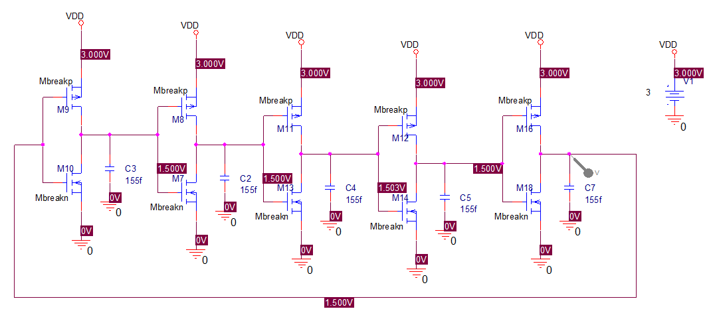

# Projeto Final - Eletrônica Digital I (EE610)

## Inversor CMOS

**a)** A condição do inversor casado é dada por

$$\begin{equation}
    k'_n\left(\frac{W}{L}\right)_n = k'_p\left(\frac{W}{L}\right)_p
\end{equation}$$

com os parâmetros $k'_p = 250\ \mu\text{m}$ e $k'_n = 500\ \mu\text{m}$, a relação entre $W_n$ e $W_p$ é dada por

$$\begin{equation}
    \frac{W_n}{W_p} = \frac{k'_p}{k'_n} = \frac{1}{2}
\end{equation}$$

Para que a corrente de saturação mínima seja $I_\text{DS,sat} = 1.5\ \text{mA}$ $(> 1\ \text{mA})$, os valores devem ser resolvidos usando a condição de saturação do transistor

$$\begin{equation}
    I_\text{DS,sat} = \frac{1}{2}\left(\frac{W}{L}\right)_n k'_n(V_{GS} - V_{t})^2
\end{equation}$$

Com os parâmetros $L=350\ \text{nm}$ e $V_t = 0.6\ \text{V}$. 

A corrente de saturação ocorre quando ambos os transistores estão em saturação, para isso $V_{GS} = V_{DD}/2 = 1.5\ V$. A solução de \cref{eq:isat} com esses dados é $W_n = 2.59\ \mu\text{m}$. Da \cref{eq:casados}, $W_p = 5.18\ \mu\text{m}$.

$$\begin{equation}
    W_n = 2.59\ \mu\text{m},\qquad W_p = 5.18\ \mu\text{m}
\end{equation}$$

**b)** Com os valores de $W_n$ e $W_p$ obtidos em (\ref{eq:res}), construiu-se o circuito 

> Circuito inversor.

Em seguida, foi realizada uma simulação *DC Sweep* do inversor, obtendo-se a curva de transferência $(v_o\ \text{x}\ v_i)$

> Curva de transferência do inversor projetado.

A curva da corrente confirma os requisitos de valor mínimo maior que $1\ \text{mA}$.

> Curva da corrente, mostrando o valor de $1.5$ mA na saturação.

\item Para o inversor CMOS vale que $V_{OL}=0$ e $V_{IL}=V_{DD}=3V$. Os valores de $V_{OH}, V_{IH}, MR_{H}\ \text{e}\ MR_L$ podem ser calculados das seguintes maneiras:

$$\begin{align*}
    V_{IH}=\frac{1}{8}(5V_{DD}-2V_t)=&1.725\ \text{V}\\
    V_{IL}=\frac{1}{8}(3V_{DD}+2V_t)=&1.275\ \text{V}\\
    M_{RH}=V_{OH}-V_{IH}=&1.275\ \text{V}\\
    M_{RL}=V_{IL}-V_{OL}=&1.275\ \text{V}
\end{align*}$$

$V_{IH}$ e $V_{IL}$ podem ser obtidos graficamente observando-se os pontos em que $\frac{dv_o}{dv_i}=-1$, como indicado na figura abaixo. Consequentemente, os valores de $M_{RH}$ e $M_{RL}$ podem ser visualizados como a largura dos intervalos de tempo limitados, respectivamente, por $V_{IH}$ e $V_{OH}$; e $V_{OL}$ e $V_{IL}$. Os valores obtidos foram $V_{IL} = 1.275\ V$ e $V_{IH}=1.723\ V$ (a diferença pode ser causada por conta da resolução do gráfico).

> Curva de transferência em verde e a derivada da curva em vermelho. Os valores nos quais a derivada é igual a $-1$ são marcados com os cursores.

**d)** A simulação temporal é mostrada abaixo

> O clock é representado pela curva vermelha e a saída do inversor pela curva verde.

Os tempos observados são

$$
t_{phl} = t_{plh} = 23\ \text{ps}$$
$$t_{r} = t_{f} = 51\ \text{ps}$$
$$2t_p = t_{phl} + t_{plh} = 46\ \text{ps}$$

## Latch

**a)** A partir do projeto do inversor no item I, construiu-se o seguinte circuito para o latch:

> Latch com elo de realimentação aberto.

Realizando uma simulação DC sweep sobre $v_z$, obteve-se o seguinte gráfico:

> Curva de transferência do latch com os pontos de operação em destaque. A curva vermelha representa a saída do latch e a curva verde, a tensão de entrada.

Nota-se que o ponto $v_z = 1.5\ \text{V}$ é instável.

**b)** Fechando o elo de realimentação e realizando uma simulação temporal, obteve-se o seguinte gráfico:

> Simulação temporal do Latch realimentado.

É possível observar que a simulação se inicia no ponto de operação instável ($v_Q = v_{\bar Q} = 1.5\ \text{V}$) e, após certo tempo, por motivos de precisão numérica, o processo de regeneração se inicia e o sistema converge para um ponto de operação estável.

**c)** O tempo para o valor de estabilidade é de 77 ps, como pode ser observado no gráfico abaixo.

> Tempo de atraso para Latch atingir ponto de estabilidade.

**d)** Para se entender os mecanismos de travamento do latch, é conveniente analisar o circuito do latch com o elo de realimentação aberto.

> Esquema de latch com elo de realimentação aberto

Partindo do ponto de operação instável ($v_W = v_X = v_Y = v_Z = \frac{V_{DD}}{2}$, observável na figura \ref{fig:transf_latch}), caso haja um pequeno incremento no valor de $v_W$, a tensão $v_X$ sofrerá um incremento negativo com amplitude maior, devido ao ganho $G_1$ do primeiro inversor. Como a tensão $v_X$ é então aplicada no segundo inversor, o resultado será um valor de $v_Z$ com um incremento maior que o de $v_W$.

Assim, como no circuito com o elo de realimentação fechado $v_Z$ é realimentado em $v_W$, caso haja um incremento no valor de $v_W$ será iniciado um processo de regeneração até que $v_Z$ e $v_W$ alcancem o $V_{OH}$ dos inversores ($V_{DD}$), estado no qual o latch permanecerá indefinidamente (enquanto houver a alimentação $V_{DD}$ dos inversores). De forma análoga, um decremento em $v_W$ travará o latch em $V_{OL} = 0$.

Os tempos de atraso presentes no processo de realimentação são oriundos das capacitâncias parasitas do latch, representadas por $C_2$ e $C_3$ na figura \ref{fig:latch_aberto}. Dessa forma, inversores projetados para transitarem mais rapidamente entre os níveis lógicos alto e baixo (com maiores áreas dos transistores e, consequentemente, maiores correntes para carga dos capacitores), resultarão em um latch com processos de regeneração mais rápidos.

# Oscilador

**a)** O circuito do oscilador e a curva da tensão de saída em função do tempo são mostrados abaixo:

> Oscilador construído usando os inversores projetados no item I.

> Tensão de saída em função do tempo no oscilador. Usando os cursores, é possível concluir que o período de oscilação é, aproximadamente, $416$ ps (2.4 GHz).

**b)** Usando a função FFT, foi possível obter o espectro do sinal (\cref{fig:fft}), com frequência fundamental de 2.4 GHz (maior pico). As outras harmônicas são múltiplos ímpares da frequência fundamental (7.2 GHz, 12 GHz).

> Espectro do sinal em escala log.

**c)** Com a frequência máxima, é possível calcular o tempo total de atraso

$$\begin{equation}
    t_p = \frac{1}{2 f} = 208\ \text{ps}
\end{equation}$$

com $f=2.4\times 10^{9}\ \text{Hz}$.

**d)** Para cada inversor, o tempo de atraso é dado por

$$\begin{equation}
    t_{p,\text{inv}} = \frac{1}{2 N f} = 42\ \text{ps}
\end{equation}$$

com $N=5$

**e)** O valor de 42 ps está coerente com o valor calculado no item I de 46 ps, com uma diferença de apenas 4 ps.

**f)** Alterando o valor da alimentação do oscilador, obtemos os seguintes espectros

> Espectro do oscilador com diferentes valores de alimentação, o primeiro com 2 V e o segundo com 7 V.

As informações obtidas de cada um dos espectros são mostradas abaixo:

> Tabela confrontando os diferentes valores de frequência para cada $V_{DD}$
> 
$V_{DD}$ (V)| Frequência (GHz) 
:-:|:-:
2 | 1.2 
3 | 2.4 
7 | 7.45

**g)** Para explicar a dependência entre a tensão de alimentação e a frequência de oscilação, é importante retomar a análise feita em aula sobre os tempos de atraso na operação dinâmica do inversor.

Naquele contexto, o valor médio de atraso foi calculado, por meio de uma aproximação (considerando $V_t\approx0.2 V_{DD}$). Sendo possível estabelecer uma relação inversa entre o tempo de atraso e a tensão de alimentação, $t_p \propto 1/V_{DD}$. Esse resultado, mesmo que sujeito a uma aproximação, indica que uma maior alimentação irá acarretar em um menor tempo de atraso. Fisicamente, o maior valor de alimentação permite que os capacitores do modelo dinâmico sejam carregados de forma mais rápida.

Dessa maneira, quando um número ímpar de inversores são conectados em cascata, formando um oscilador, o menor tempo de atraso individual tem como consequência o menor tempo de atraso total e, portanto, uma maior frequência de oscilação máxima.

## Flip-Flop SR

**a)** Usando as dimensões dos inversores do item I (\ref{eq:res}), é possível estimar o valor mínimo necessário da razão $W/L$ dos transistores NMOS SET/RESET e CLOCK para que ocorra o chaveamento.

Supondo que inicialmente o FF está no estado $Q=0$, vamos restringir a análise para a porção esquerda do circuito, com os transistores M1 e M2. Nesse cenário, o transistor M1 está desligado e o transistor M2 está ligado. A metade resultante é um inversor cuja rede *pull-up* é o M2 e a rede *pull-down* é a combinação em série de SET e CLOCK. A combinação em série da rede *pull-down*, pode ser analisada como um transistor com área equivalente dada por

$$\begin{equation}
    \left(\frac{W}{L}\right)_\text{Set/Clk} = 2\left(\frac{W}{L}\right)_\text{eq}
\end{equation}$$

Para garantir o chaveamento do FF, após um sinal de SET, deve-se garantir que a saída do inversor, $v_{\overline{Q}}$, chegue até

$$\begin{equation}
    V_{OL} = 1.5 - \frac{5}{10} = 1\ V
\end{equation}$$

Nessa condição, PMOS e NMOS estão em triodo.

$$\begin{equation}
    V_{SDp} = 2 < 2.4 = V_{SGp} - V_t
\end{equation}$$

$$\begin{equation}
    V_{DSn} = 1 < 2.4 = V_{GSn} - V_t
\end{equation}$$

A corrente que passa pelo PMOS é

$$\begin{equation}
    I_{DSp} = 10.36\ \text{mA}
\end{equation}$$

Igualando a corrente do NMOS com \ref{eq:corrpmos} e resolvendo para a razão de área equivalente

$$\begin{equation}
    10.36\ \text{mA} = k_n'\left(\frac{W}{L}\right)_\text{eq}\left((V_{GS} - V_t)V_{DS} - \frac{1}{2}V_{DS}^2\right)
\end{equation}$$

$$\begin{equation}
    \left(\frac{W}{L}\right)_\text{eq} = 10.9053
\end{equation}$$

Com essa informação, é possível obter as razões de área dos transistores SET/CLK:

$$\begin{equation}
    \left(\frac{W}{L}\right)_\text{Set/Clk} = 21.8105 \Rightarrow W = 7.634\ \mu\text{m}
\end{equation}$$

Vamos projetar o circuito com um valor de $W=7.7\ \mu\text{m}$

> Circuito com Flip-Flop projetado.

**b)** O pulso de SET deve possuir largura grande o suficiente para garantir que o processo de regeneração aconteça durante o chaveamento. Uma estimativa para a largura mínima do pulso de SET tal que essa condição seja satisfeita pode ser obtida como a soma do tempo que $v_{\bar Q}$ leva para ir de $V_{DD}$ até $\frac{V_{DD}}{2}$ no pulso, do tempo que $v_Q$ leva para ir de $0$ a $\frac{V_{DD}}{2}$ e do tempo de regeneração do latch.

No pulso de SET, o tempo de queda do $v_{\bar Q}$ é 27 ps e o tempo de subida do $v_{Q}$ é 79 ps. Além disso, considerando o tempo de realimentação do Latch, \cref{fig:atraso_latch}, o tempo mínimo para o pulso de set seria a soma dos 3.

$$\begin{equation}
    T_\text{SET} = 185\ ps
\end{equation}$$

**c)** Aterrando o pulso de RESET, foi possível realizar uma simulação de *DC sweep* com a tensão de $V_\text{SET}$, obtendo-se a \cref{fig:ff_sweep}.

> Corrente em verde que passa pelo inversor com saída $V_Q$. Corrente em vermelho que passa pelo inversor com saída $V_{\overline{Q}}$. Tensão em azul é $V_Q$ e tensão em vermelho é $V_{\overline{Q}}$.

Nessa figura, observa-se que o processo de chaveamento do Latch passa a acontecer em torno de $V_\text{SET} = 1.75\ \text{V}$.

**d)** A simulação temporal que demonstra todos os possíveis casos da tabela verdade do FF, segue abaixo:

> Pulsos de Set e Reset que avaliam a tabela verdade do Flip-Flop.

$S$ | $R$ | $Q_{n+1}$
:-:|:-:|:-:
0 | 0 | $Q_n$ 
0 | 1 | 0
1 | 0 | 1
1 | 1 | $\times$